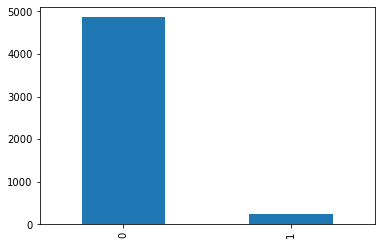
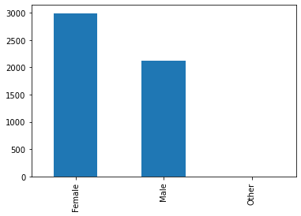

```python
import numpy as np 
import pandas as pd 
import matplotlib.pyplot as plt
```


```python
df = pd.read_csv('healthcare-dataset-stroke-data.csv')
df.head()
```


<div>
<style scoped>
    .dataframe tbody tr th:only-of-type {
        vertical-align: middle;
    }

    .dataframe tbody tr th {
        vertical-align: top;
    }

    .dataframe thead th {
        text-align: right;
    }
</style>
<table border="1" class="dataframe">
  <thead>
    <tr style="text-align: right;">
      <th></th>
      <th>id</th>
      <th>gender</th>
      <th>age</th>
      <th>hypertension</th>
      <th>heart_disease</th>
      <th>ever_married</th>
      <th>work_type</th>
      <th>Residence_type</th>
      <th>avg_glucose_level</th>
      <th>bmi</th>
      <th>smoking_status</th>
      <th>stroke</th>
    </tr>
  </thead>
  <tbody>
    <tr>
      <th>0</th>
      <td>9046</td>
      <td>Male</td>
      <td>67.0</td>
      <td>0</td>
      <td>1</td>
      <td>Yes</td>
      <td>Private</td>
      <td>Urban</td>
      <td>228.69</td>
      <td>36.6</td>
      <td>formerly smoked</td>
      <td>1</td>
    </tr>
    <tr>
      <th>1</th>
      <td>51676</td>
      <td>Female</td>
      <td>61.0</td>
      <td>0</td>
      <td>0</td>
      <td>Yes</td>
      <td>Self-employed</td>
      <td>Rural</td>
      <td>202.21</td>
      <td>NaN</td>
      <td>never smoked</td>
      <td>1</td>
    </tr>
    <tr>
      <th>2</th>
      <td>31112</td>
      <td>Male</td>
      <td>80.0</td>
      <td>0</td>
      <td>1</td>
      <td>Yes</td>
      <td>Private</td>
      <td>Rural</td>
      <td>105.92</td>
      <td>32.5</td>
      <td>never smoked</td>
      <td>1</td>
    </tr>
    <tr>
      <th>3</th>
      <td>60182</td>
      <td>Female</td>
      <td>49.0</td>
      <td>0</td>
      <td>0</td>
      <td>Yes</td>
      <td>Private</td>
      <td>Urban</td>
      <td>171.23</td>
      <td>34.4</td>
      <td>smokes</td>
      <td>1</td>
    </tr>
    <tr>
      <th>4</th>
      <td>1665</td>
      <td>Female</td>
      <td>79.0</td>
      <td>1</td>
      <td>0</td>
      <td>Yes</td>
      <td>Self-employed</td>
      <td>Rural</td>
      <td>174.12</td>
      <td>24.0</td>
      <td>never smoked</td>
      <td>1</td>
    </tr>
  </tbody>
</table>
</div>


```python
#Let's get some general info 
df.info()
```

    <class 'pandas.core.frame.DataFrame'>
    RangeIndex: 5110 entries, 0 to 5109
    Data columns (total 12 columns):
     #   Column             Non-Null Count  Dtype  
    ---  ------             --------------  -----  
     0   id                 5110 non-null   int64  
     1   gender             5110 non-null   object 
     2   age                5110 non-null   float64
     3   hypertension       5110 non-null   int64  
     4   heart_disease      5110 non-null   int64  
     5   ever_married       5110 non-null   object 
     6   work_type          5110 non-null   object 
     7   Residence_type     5110 non-null   object 
     8   avg_glucose_level  5110 non-null   float64
     9   bmi                4909 non-null   float64
     10  smoking_status     5110 non-null   object 
     11  stroke             5110 non-null   int64  
    dtypes: float64(3), int64(4), object(5)
    memory usage: 479.2+ KB


```python
#We can see we have equal number of non null values for all variables except bmi. 
#We will need to take away any null values.

# drop all rows with any NaN and NaT values
df1 = df.dropna()

#check info of new dataset 
df1.info()
```

    <class 'pandas.core.frame.DataFrame'>
    Int64Index: 4909 entries, 0 to 5109
    Data columns (total 12 columns):
     #   Column             Non-Null Count  Dtype  
    ---  ------             --------------  -----  
     0   id                 4909 non-null   int64  
     1   gender             4909 non-null   object 
     2   age                4909 non-null   float64
     3   hypertension       4909 non-null   int64  
     4   heart_disease      4909 non-null   int64  
     5   ever_married       4909 non-null   object 
     6   work_type          4909 non-null   object 
     7   Residence_type     4909 non-null   object 
     8   avg_glucose_level  4909 non-null   float64
     9   bmi                4909 non-null   float64
     10  smoking_status     4909 non-null   object 
     11  stroke             4909 non-null   int64  
    dtypes: float64(3), int64(4), object(5)
    memory usage: 498.6+ KB


```python
#Perfect now we have only non-null values, now let's get some overall statistics 
df1.describe()
```


<div>
<style scoped>
    .dataframe tbody tr th:only-of-type {
        vertical-align: middle;
    }

    .dataframe tbody tr th {
        vertical-align: top;
    }

    .dataframe thead th {
        text-align: right;
    }
</style>
<table border="1" class="dataframe">
  <thead>
    <tr style="text-align: right;">
      <th></th>
      <th>id</th>
      <th>age</th>
      <th>hypertension</th>
      <th>heart_disease</th>
      <th>avg_glucose_level</th>
      <th>bmi</th>
      <th>stroke</th>
    </tr>
  </thead>
  <tbody>
    <tr>
      <th>count</th>
      <td>4909.000000</td>
      <td>4909.000000</td>
      <td>4909.000000</td>
      <td>4909.000000</td>
      <td>4909.000000</td>
      <td>4909.000000</td>
      <td>4909.000000</td>
    </tr>
    <tr>
      <th>mean</th>
      <td>37064.313506</td>
      <td>42.865374</td>
      <td>0.091872</td>
      <td>0.049501</td>
      <td>105.305150</td>
      <td>28.893237</td>
      <td>0.042575</td>
    </tr>
    <tr>
      <th>std</th>
      <td>20995.098457</td>
      <td>22.555115</td>
      <td>0.288875</td>
      <td>0.216934</td>
      <td>44.424341</td>
      <td>7.854067</td>
      <td>0.201917</td>
    </tr>
    <tr>
      <th>min</th>
      <td>77.000000</td>
      <td>0.080000</td>
      <td>0.000000</td>
      <td>0.000000</td>
      <td>55.120000</td>
      <td>10.300000</td>
      <td>0.000000</td>
    </tr>
    <tr>
      <th>25%</th>
      <td>18605.000000</td>
      <td>25.000000</td>
      <td>0.000000</td>
      <td>0.000000</td>
      <td>77.070000</td>
      <td>23.500000</td>
      <td>0.000000</td>
    </tr>
    <tr>
      <th>50%</th>
      <td>37608.000000</td>
      <td>44.000000</td>
      <td>0.000000</td>
      <td>0.000000</td>
      <td>91.680000</td>
      <td>28.100000</td>
      <td>0.000000</td>
    </tr>
    <tr>
      <th>75%</th>
      <td>55220.000000</td>
      <td>60.000000</td>
      <td>0.000000</td>
      <td>0.000000</td>
      <td>113.570000</td>
      <td>33.100000</td>
      <td>0.000000</td>
    </tr>
    <tr>
      <th>max</th>
      <td>72940.000000</td>
      <td>82.000000</td>
      <td>1.000000</td>
      <td>1.000000</td>
      <td>271.740000</td>
      <td>97.600000</td>
      <td>1.000000</td>
    </tr>
  </tbody>
</table>
</div>


```python
sizes = df1['stroke'].value_counts(sort = True)
ax = plt.figure()
sizes.plot(kind='bar')
```


    <AxesSubplot:>


    

    


```python
#Plot shows we have a lot more of patients that did not have stroke (0) than did have stroke (1)
```


```python
#Lets have a look at the gender distribution
sizes = df1['gender'].value_counts(sort = True)
ax = plt.figure()
sizes.plot(kind='bar')

```


    <AxesSubplot:>


    

    


```python
#We see as well that there are a lot more female patients than male
```


```python

```
